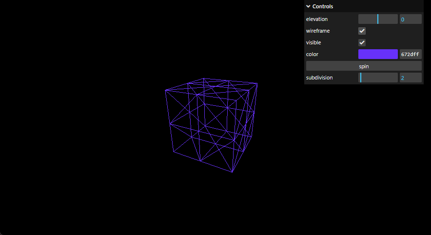
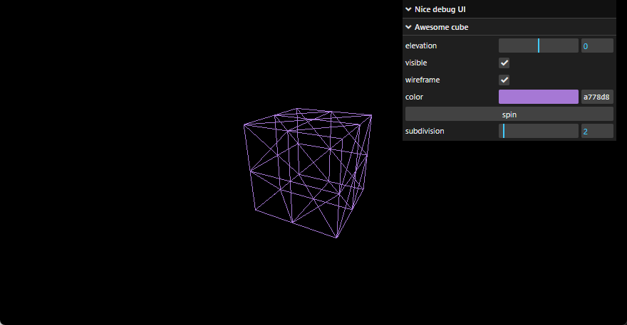

# Three.js Journey

## Setup

Download [Node.js](https://nodejs.org/en/download/).
Run this followed commands:

```bash
# Install dependencies (only the first time)
pnpm install

# Run the local server at localhost:8080
pnpm run dev

# Build for production in the dist/ directory
pnpm run build
```

---

### 09-debug-ui



### 09-debug-ui-final

Added debug folder and hide Debug UI function.

